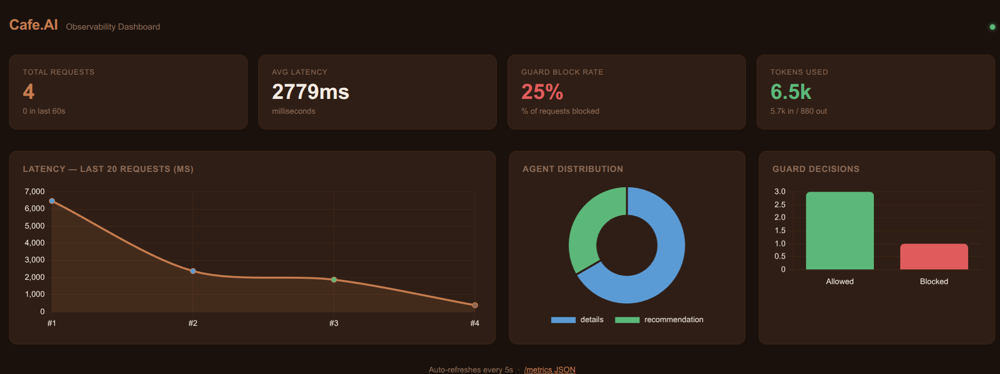

# ☕ Fero Cafe — AI-Powered Coffee Shop Chatbot

> **Open source.** A full-stack conversational commerce app built to explore multi-agent LLM pipelines in a real-world setting. A customer types naturally — *"I want a latte and a croissant"* — and a pipeline of specialized agents handles intent classification, menu validation, personalized recommendations, and order state across the conversation. The result is a cross-platform mobile app backed by a fully async Python API with SSE streaming, SQLite session persistence, 120 passing tests, LLM evals, and a live observability dashboard.

[](https://python.org)
[](https://fastapi.tiangolo.com)
[](https://expo.dev)
[](https://groq.com)
[]()
[](LICENSE)
[]()

---

## 📹 Demo


*End-to-end walkthrough: multi-item ordering, guard agent, RAG-powered Q&A, and cart auto-population from chat*

---

## 📊 Observability Dashboard



*Live dashboard at `http://localhost:8000/dashboard` — request latency, token usage, agent distribution, and guard block rate. Auto-refreshes every 5s.*

---

## ✨ Features

| Feature | What it does |
|---------|--------------|
| 🧠 **Multi-agent pipeline** | Guard → Classification → Details / Order / Recommendation |
| 🔍 **RAG (Retrieval-Augmented Generation)** | Answers menu & shop questions via Pinecone vector DB |
| 📝 **Smart ordering** | Multi-turn conversation with menu validation and persistent state |
| 🎯 **Personalized recommendations** | Apriori market basket analysis + popularity rankings |
| 📱 **React Native app** | Browse menu, chat, review cart — one unified flow |
| ⚡ **SSE streaming** | Responses stream token-by-token via `POST /chat/stream`; first token at ~1s |
| 💾 **Session persistence** | SQLite-backed sessions; conversation restores on reload; "New chat" to reset |
| 🔄 **Provider-agnostic LLM** | Swap Groq, RunPod, or OpenAI with a single `.env` change |
| ✅ **120 passing tests** | Unit + eval runners — no API key needed for unit tests |
| 📊 **Observability dashboard** | Live `/dashboard` — latency, tokens, routing, guard block rate |
| 🧪 **LLM evals** | Guard, classification, recommendation accuracy tested against real LLM |
| 🖼️ **Bundled product images** | Served from local assets — no Firebase Storage required |

---

## 🏗️ Architecture

```
React Native App (Expo)
        │
        │  POST /chat/stream  { messages, session_id }  (SSE)
        ▼
   FastAPI Server  (local_server.py)  ← fully async
        │
        ▼
   AgentController
        │
        ├── GuardAgent           → blocks off-topic / harmful queries
        │
        ├── ClassificationAgent  → routes intent
        │
        └── DetailsAgent         → RAG: sentence-transformers → Pinecone → LLM
            OrderTakingAgent     → multi-turn order + auto-upsell
            RecommendationAgent  → Apriori / popularity rankings
                │
                ▼
           Groq API  (llama-3.3-70b-versatile)
```

> 💡 **Design note:** Every agent uses `AsyncOpenAI` with a configurable `base_url` — no vendor lock-in. Invalid routing returns a graceful error rather than crashing the pipeline.

---

## 🛠️ Tech Stack

| Layer | Technology | Why |
|-------|------------|-----|
| **LLM** | Groq API (`llama-3.3-70b`) | Free tier, fast inference |
| **Embeddings** | sentence-transformers (all-MiniLM-L6-v2) | Runs locally, no API cost |
| **Vector DB** | Pinecone | Free serverless index |
| **Backend** | Python 3.12 + FastAPI | Async, type-safe |
| **Frontend** | React Native + Expo Router | Cross-platform, hot reload |
| **Styling** | NativeWind (Tailwind) | Utility-first, rapid UI |
| **Recommendations** | scikit-learn (Apriori) | Market basket analysis |
| **Testing** | pytest + AsyncMock | 120 tests, no API key needed for unit tests |
| **Observability** | structlog + Chart.js dashboard | Structured logs + live `/dashboard` |
| **Product catalog** | Firebase Realtime DB | Live product data |
| **Product images** | Bundled local assets | No Firebase Storage required |

---

## 🚀 Quick Start

### Prerequisites

```bash
# Required
Python 3.12+
Node.js 18+

# Recommended
uv  # fast Python package manager

# Free accounts needed
Groq API key  →  https://console.groq.com
```

### 1. Backend Setup

```bash
# Clone and enter repo
git clone https://github.com/silvaxxx1/Cafe.AI.git
cd Cafe.AI

# Create virtual environment
uv venv .venv --python 3.12
source .venv/bin/activate        # Windows: .venv\Scripts\activate

# Install dependencies
cd python_code/api
uv pip install -r requirements.txt

# Pin httpx — newer versions break the openai async client
uv pip install "httpx==0.27.2"

# Configure environment
cp .env_example .env
```

Edit `.env` with your credentials:

```ini
# Note: these variable names reflect RunPod origins — they work equally for Groq
RUNPOD_TOKEN=your-groq-api-key-here
RUNPOD_CHATBOT_URL=https://api.groq.com/openai/v1
MODEL_NAME=llama-3.3-70b-versatile
```

Start the server:

```bash
python local_server.py
# ✅ Agents ready.
# 🚀 Uvicorn running on http://0.0.0.0:8000
```

### 2. Frontend Setup

```bash
# Open a new terminal
cd coffee_shop_app

# Copy config and fill in Firebase + backend URL
cp .env_example.txt .env

# Install and run
npm install
npm run web    # Opens at http://localhost:8081
```

### 3. Verify the Integration

```bash
# Streaming endpoint (what the app uses)
curl -N -X POST http://localhost:8000/chat/stream \
  -H "Content-Type: application/json" \
  -d '{"input": {"messages": [{"role": "user", "content": "I want a latte and a croissant"}]}}'
```

**Expected:** SSE token stream ending with `{"type":"done","memory":{"order":[...]}}` — both items captured with correct prices. 🎯

---

## 🧪 Testing

```bash
cd python_code/api

# Unit tests (no API key needed)
python -m pytest tests/ -v

# LLM evals (requires .env with valid Groq key)
python -m tests.evals.eval_guard
python -m tests.evals.eval_classification
python -m tests.evals.eval_recommendation

# Or run everything
make test   # unit tests
make evals  # LLM evals
```

120 unit tests cover all agents, the server (including streaming and session endpoints), and the eval runner logic. All LLM calls are mocked with `AsyncMock` — no API key needed.

Evals hit the real LLM and report per-case PASS/FAIL with a pass rate. Exit 1 if below 80%.

---

## 💬 Example Prompts

| You say… | Agent handles it |
|----------|-----------------|
| *"Who won the World Cup?"* | 🛡️ Guard blocks |
| *"What are your opening hours?"* | 📚 Details (RAG) |
| *"Tell me about Fero Cafe"* | 📚 Details (RAG) |
| *"What do you recommend?"* | 🎯 Recommendation |
| *"What pastry should I get?"* | 🎯 Recommendation (category-filtered) |
| *"I want a latte and a croissant"* | 📝 Order — 2 items captured |
| *"Also add an espresso"* | 📝 Order — context remembered |
| *"No thanks, that's all"* | 📝 Order — finalised with total |

---

## 🔧 Advanced Setup

### Pinecone (RAG Q&A)

```bash
# 1. Create a free account at pinecone.io
# 2. Add to python_code/api/.env:
PINECONE_API_KEY=your-pinecone-key
PINECONE_INDEX_NAME=coffeeshop

# 3. Build the index (runs locally — no API calls)
cd coffee_shop_customer_service_chatbot/python_code
jupyter notebook build_vector_database.ipynb
```

Uses `sentence-transformers/all-MiniLM-L6-v2` locally. Without Pinecone, `DetailsAgent` is gracefully disabled and the rest of the app functions normally.

### Firebase (live product catalog)

Firebase is pre-configured for the `fero-ai` project. To use your own:

```bash
# 1. Create a project at console.firebase.google.com
# 2. Enable Realtime Database (Spark / free plan — Storage NOT required)
# 3. Download service account JSON from Project Settings → Service Accounts
# 4. Fill python_code/.env with service account fields
# 5. Seed products (images are local, no upload needed):
cd python_code
jupyter notebook firebase_uploader.ipynb

# 6. Add Firebase web config to coffee_shop_app/.env
```

Product images are bundled in `coffee_shop_app/assets/images/products/` and mapped by filename in `constants/productImages.ts`. Firebase stores only the filename (e.g. `cappuccino.jpg`), not a remote URL.

> Without Firebase, the home tab shows an empty menu — but the chat tab works fully. The agent validates orders against `menu.json`, which is always loaded server-side.

### Running on a Physical Device

1. Install [Expo Go](https://expo.dev/go) on your phone
2. Ensure your phone and computer are on the same Wi-Fi network
3. Update `coffee_shop_app/.env`:
   ```env
   EXPO_PUBLIC_RUNPOD_API_URL='http://192.168.x.x:8000/chat'  # your local IP
   ```
4. Run and scan the QR code:
   ```bash
   npm start
   ```

---

## 🚢 Production Deployment (RunPod)

```bash
cd python_code/api
docker build -t your-dockerhub/fero-cafe:latest .
docker push your-dockerhub/fero-cafe:latest
```

1. Create a RunPod serverless endpoint with the image
2. Set env vars from `.env_example`
3. Update `EXPO_PUBLIC_RUNPOD_API_URL` in the frontend to your RunPod endpoint

---

## 📁 Project Structure

```
Cafe.AI/
├── 📱 coffee_shop_app/              # React Native (Expo)
│   ├── app/
│   │   ├── _layout.tsx            # Root layout: providers + web frame
│   │   ├── index.tsx              # Splash / landing screen
│   │   ├── details.tsx            # Product detail
│   │   ├── thankyou.tsx           # Order confirmation
│   │   └── (tabs)/
│   │       ├── _layout.tsx        # Tab bar with cart badge
│   │       ├── home.tsx           # Menu browse + category filter
│   │       ├── chatRoom.tsx       # AI chat → auto-fills cart
│   │       └── order.tsx          # Cart review + checkout
│   ├── components/                # CartContext, MessageList, UI components
│   ├── constants/
│   │   ├── theme.ts               # Light/dark token system + useTheme()
│   │   ├── responsive.ts          # useGridColumns(), webPointer utils
│   │   └── productImages.ts       # filename → require() map
│   ├── services/                  # chatBot.ts, productService.ts (cached)
│   ├── assets/images/products/    # Bundled product images (18 items)
│   ├── polyfills.ts               # setImmediate shim for web
│   └── config/                    # Firebase config
│
└── 🐍 python_code/
    ├── api/
    │   ├── agents/
    │   │   ├── guard_agent.py
    │   │   ├── classification_agent.py
    │   │   ├── details_agent.py
    │   │   ├── order_taking_agent.py
    │   │   ├── recommendation_agent.py
    │   │   ├── agent_protocol.py     # async Protocol
    │   │   └── utils.py
    │   ├── tests/                 # 120 tests ✅ (unit + eval runners)
    │   ├── recommendation_objects/
    │   ├── local_server.py        # Dev server (async FastAPI)
    │   ├── main.py                # RunPod entry point
    │   ├── agent_controller.py    # Pipeline orchestration
    │   ├── session.py             # SQLite session store
    │   └── menu.json              # Single source of truth for product names
    ├── products/
    │   ├── products.jsonl         # Full product data (seeded to Firebase)
    │   └── images/                # Source images
    ├── firebase_uploader.ipynb    # Seeds Firebase (no Storage needed)
    ├── build_vector_database.ipynb
    └── recommendation_engine_training.ipynb
```

---

## 🔐 Environment Variables

### Backend (`python_code/api/.env`)

| Variable | Required | Description |
|----------|----------|-------------|
| `RUNPOD_TOKEN` | ✅ Yes | Your Groq API key (legacy name — works for any provider) |
| `RUNPOD_CHATBOT_URL` | ✅ Yes | `https://api.groq.com/openai/v1` |
| `MODEL_NAME` | ✅ Yes | `llama-3.3-70b-versatile` |
| `PINECONE_API_KEY` | ❌ Optional | Enables RAG in DetailsAgent |
| `PINECONE_INDEX_NAME` | ❌ Optional | Pinecone index name |

### Firebase Seeding (`python_code/.env`)

| Variable | Description |
|----------|-------------|
| `FIREBASE_*` | Service account fields from Firebase console |
| `FIREBASE_DATABASE_URL` | Realtime Database URL |

### Frontend (`coffee_shop_app/.env`)

| Variable | Required | Description |
|----------|----------|-------------|
| `EXPO_PUBLIC_RUNPOD_API_URL` | ✅ Yes | Backend URL (e.g. `http://localhost:8000/chat`) |
| `EXPO_PUBLIC_FIREBASE_API_KEY` | ✅ Yes | Firebase web API key |
| `EXPO_PUBLIC_FIREBASE_DATABASE_URL` | ✅ Yes | Realtime Database URL |
| `EXPO_PUBLIC_FIREBASE_*` | ✅ Yes | Remaining Firebase web config fields |

---

## 🗺️ Roadmap

**v2 — completed**
- [x] **90 tests** — unit + eval runner tests, no API key needed for unit tests *(now 120 after v3)*
- [x] **Evals** — guard, classification, recommendation runners against the real LLM
- [x] **Observability** — structlog structured logging + live `/dashboard`
- [x] **CI/CD** — GitHub Actions: run tests on every push

**v3 — completed**
- [x] **Streaming responses** — `POST /chat/stream` SSE endpoint; tokens stream as they're generated; first token at ~1s
- [x] **Server-side session memory** — SQLite-backed `SessionStore`; `GET /session/{id}` restores history on reload; "New chat" button clears it
- [x] **Production hardening** — rate limiting via `slowapi`, startup config validation, locked CORS origins, typed input validation

---

## 📄 License

MIT — free for personal and commercial use.

---

## 🙏 Acknowledgments

- [Groq](https://groq.com) for free, fast LLM inference
- [Pinecone](https://pinecone.io) for serverless vector storage
- [Expo](https://expo.dev) for React Native tooling
- [Firebase](https://firebase.google.com) for real-time product catalog

---

**Built with ☕ and 🤖 by SilvaLAB**